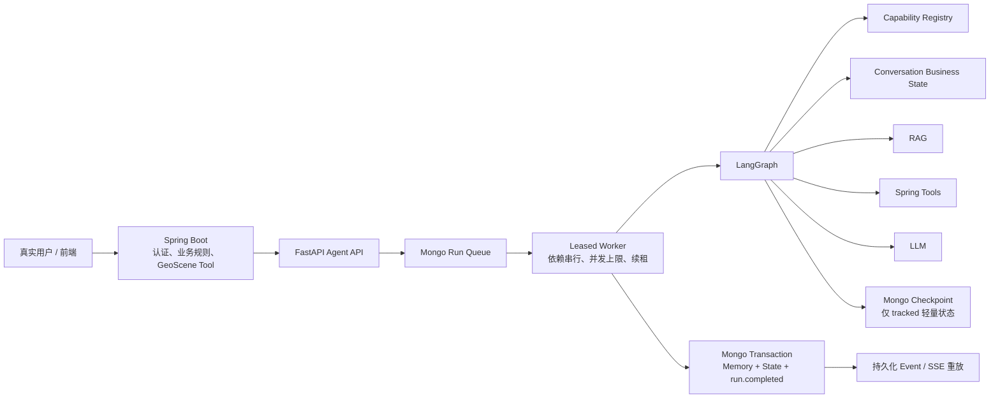

# YJDL Agent 修复后架构复审报告

> 复审日期：2026-08-16  
> 复审范围：连续对话、Run/Conversation/Event 持久化、Worker 租约、Checkpoint、SSE、Token 配额、启动配置与发布测试  
> 结论：本轮 P0 问题已经关闭，可以进入受控上线验证；仍有 P1 模块拆分和长期数据治理工作，不建议在缺少监控与 Redis 分布式配额的情况下直接扩大到高并发多租户流量。

## 1. 执行摘要

真实用户测试中的失败不是“上一轮记忆尚未写入”。数据库时间线证明第二轮 Run 已读取第一轮提交后的 state version。真正原因是：路由器不知道 Planner 已支持 `convenience=PREFER_HIGH`，会话状态又没有保存上一轮行政区、房价和 Tool 参数，所以“从这里面选社区便利度稍微高一些的”被误判为未知字段并进入 `CLARIFY`。

本轮已经完成以下修复：

1. 将 Memory、Conversation State 和 `run.completed` 放在同一事务内提交，客户端看到完成事件时，上一轮状态已经可读。
2. Run、Event、Conversation、Memory、账本和 Checkpoint 支持 MongoDB；本机 `rs0` 连接及事务测试通过。
3. Worker 使用数据库租约、续租、依赖队列和并发上限；快速追问按 Conversation 依赖链串行执行。
4. 新增结构化 Conversation Business State，成功地图查询会保存实体、行政区、硬筛选、偏好、Tool 参数和轻量结果引用。
5. 路由能力与 Planner 能力统一到能力注册表，社区便利度不再被视为未知字段。
6. 对话总结和寒暄新增确定性 `CONVERSATION` 路由，不调用 LLM、RAG 或 Tool，也不覆盖最后一次成功业务条件。
7. 完整 Tool 输出和地图 features 改为 LangGraph 临时状态；Checkpoint 只保留轻量摘要。普通地图结果默认限制为 50 条。
8. 修复模型 usage 在 LangGraph 子任务中无法回传父任务的问题，并验证并发 Run 隔离。
9. 修复根图误用 `checkpoint_ns` 导致滚动恢复无法读取快照的问题；新格式使用版本化 `thread_id`，并兼容两种旧格式。

## 2. 修复后的业务架构



当前事实来源如下：

| 数据 | 事实来源 | 一致性策略 |
| --- | --- | --- |
| Run / Event | MongoDB | 同一 Store，Event sequence 单调递增 |
| Conversation State / Memory | MongoDB | `base_state_version` CAS + 完成事务 |
| Worker Queue / Lease | MongoDB Run | 原子 claim、lease generation、续租和过期回收 |
| LangGraph Checkpoint | MongoDB | `agent-v2:<conversationId>` 版本化 thread |
| Tool 业务数据 | Spring Boot | Catalog 与输入/输出 Schema 校验 |
| RAG 索引 | 本地只读索引 | 不作为会话事实来源 |

## 3. 连续对话状态

`ConversationBusinessState` 当前保存：

- `entityContext.entityType`、行政区、业务对象 ID、图层 ID；
- `queryContext.lastSuccessfulQuery`；
- 最后一次 Tool 名称与参数；
- `hardFilters` 和 `preferences`；
- 不含 feature 明细的 `resultRef`；
- 最近 12 轮 `historyDigest`；
- Map Context、回答摘要和更新时间。

状态更新规则是本轮设计中最重要的边界：只有成功完成的 `MAP_QUERY` 才能替换可复用的业务查询状态。`CLARIFY`、`CONVERSATION`、寒暄和总结只追加交互摘要，不会覆盖上一轮行政区、价格与偏好。

原始失败话术现已形成完整回归：

```text
第一轮：筛选中山区房价不高于 20000 的住宅
第二轮：从这里面选社区便利度稍微高一些的
```

第二轮会确定性继承并调用：

```json
{
  "toolName": "searchHousingCandidates",
  "arguments": {
    "districts": ["中山区"],
    "hardFilters": {"priceMax": 20000},
    "preferences": {
      "convenience": {"enabled": true, "level": "PREFER_HIGH"}
    }
  }
}
```

## 4. 事务与并发边界

成功 Run 的提交顺序现在是：

```text
执行完成
  -> 写 Conversation Memory
  -> CAS 更新 Conversation State
  -> 写 run.completed Event 并更新 Run
  -> MongoDB/SQLite 事务提交
  -> SSE 客户端读取到 run.completed
```

因此不存在“客户端已看到完成，但下一轮仍读不到记忆”的提交窗口。快速连续请求会先形成 `depends_on_run_id` 链；后续 Run 只有在前序终态提交后才能被 Worker claim，并读取新的 `base_state_version`。

Worker 层已有：

- 全局 Worker concurrency；
- tenant active/queue 上限；
- Run lease、generation fencing 和续租；
- 进程关闭时重排队；
- 多实例共享 claim；
- state version conflict 保护。

## 5. Checkpoint 与 SSE

原始真实请求返回约 200 个 feature，SSE 超过 130 KB，完整 Tool 输出又反复进入 Checkpoint，造成单会话快照持续膨胀。

当前 `tool_outputs` 和 `map_result` 使用 `UntrackedValue`，只服务本次执行及 SSE；持久化状态仅保存 `map_summary`。自动化测试直接读取 Graph snapshot，确认不存在 `map_result` 和 `tool_outputs`，且摘要 JSON 小于 5 KB。

普通地图 Planner 默认将所有调用合计限制在 50 条，可通过 `AGENT_MAP_RESULT_LIMIT` 在 1 到 200 之间配置。出现 `exceededTransferLimit=true` 时，回答使用“当前显示前 N 个”，不再把返回页大小误报为总命中数。

滚动恢复同时修复了一个复审中新发现的问题：`checkpoint_ns` 是 LangGraph 子图命名空间，不能作为根图版本标签。新 Checkpoint 使用 `agent-v2:<conversationId>` thread ID；恢复逻辑仍可读取旧的 conversation + namespace 格式以及更早的 run ID 格式。

## 6. Token 与配额

旧实现每次模型响应都向 ContextVar 写入一个新字典。LangGraph 子任务复制 Context 后，父任务仍读取旧字典，导致 `quota_ledger.total_tokens` 长期为 0。

现在每个 Run 在父任务中创建独立 usage 字典，子任务原地累加同一对象。测试覆盖：

- 子任务 usage 回传父任务；
- 同一 Run 多次模型调用累加；
- 两个并发 Run 相互隔离。

剩余边界：只有模型供应商返回标准 `usage` 字段时才能准确结算；生产监控应对“成功模型调用但 usage 为 0”设置告警。

## 7. 启动与部署配置

`start.bat` 当前行为：

- 存在 `.env`：完全尊重文件配置；
- 不存在 `.env`：默认连接 `mongodb://127.0.0.1:27017/?replicaSet=rs0`；
- 默认启动 API 内置 Worker，兼容当前本地使用方式；
- `start.bat api [端口]` 关闭内置 Worker；
- `start.bat worker` 启动独立租约 Worker；
- 启动日志只显示 backend 和 worker mode，不打印 URI 或凭据；
- 无效端口会在停止现有服务之前失败。

这不会改变 Spring Boot 的端口或 Mongo 配置。Spring Tool 服务仍通过 `SPRING_BOOT_BASE_URL` 调用。

## 8. 测试结果

测试收集总数为 123：

| 测试层 | 结果 |
| --- | --- |
| 默认完整套件 | 116 passed，7 live skipped |
| Mongo live：事务、多实例、快速追问、Checkpoint | 3 passed |
| Spring live：Catalog 与真实 Tool | 3 passed |
| LLM live：RAG 图与地图 Planner | 2 passed |
| Python compileall | passed |
| `start.bat` 无效端口预检 | passed，未停止现有服务 |

关键新增场景包括：连续两轮真实话术、快速追问依赖链、寒暄与总结、成功状态不被覆盖、Token 并发隔离、Checkpoint 临时大对象、多实例 claim、滚动发布恢复和 Mongo 事务。

服务使用更新后的 `start.bat` 重启后，又通过真实 HTTP API 执行了三轮验证：

| Run | 输入 | 路由 | 结果 |
| --- | --- | --- | --- |
| `a1564330-2e9b-4cb0-9e9c-bb383352ba2a` | 筛选中山区房价不高于 20000 的住宅 | `MAP_QUERY` | `queryMapPoints`，limit 50，SSE 36,161 bytes，10,659 tokens |
| `3618bc20-ccd9-47f9-8f67-e7e73daebbaf` | 从这里面选社区便利度稍微高一些的 | `MAP_QUERY` | `searchHousingCandidates`，继承中山区和 20,000 上限，20 个候选，0 LLM tokens |
| `54b11e2f-e32c-413d-b5c8-c61d094edc0d` | 我们都说了什么，总结一下 | `CONVERSATION` | 0 Tool、0 LLM tokens，SSE 2,432 bytes |

三轮后 Mongo Conversation State 为 version 3；总结轮没有覆盖最后成功查询，仍保留 `priceMax=20000` 和 `convenience=PREFER_HIGH`。启动日志明确显示 `Storage=mongodb Checkpoint=mongodb WorkerEnabled=true`。

## 9. 代码架构评估

### 已改善

- `capabilities.py` 成为路由与会话理解的统一业务能力来源。
- `conversation_state.py` 封装业务状态 Schema、继承和提交构建，Runtime 不再手工拼接嵌套字典。
- `conversation.py` 隔离确定性对话意图。
- `map_summary.py` 统一 Workflow、Runtime 和 Memory 使用的脱敏轻量摘要。
- Store 继续负责事务和 CAS，Workflow 不直接操作数据库。
- 完整结果与持久状态的边界通过 LangGraph channel 类型显式表达。

### 剩余技术债

| 优先级 | 问题 | 上线影响 | 建议 |
| --- | --- | --- | --- |
| P1 | `workflow.py` 仍约 1,870 行 | 修改路由、Planner 或结果映射时回归面大 | 拆为 routing、housing planner、map planner、execution、answer 五个模块 |
| P1 | `store.py` 仍约 1,350 行 | SQLite schema、队列、事务和指标耦合 | 提取 repository protocol，并按 run/event/conversation/metrics 分仓储 |
| P1 | Mongo Checkpoint 暂无会话级保留期 | 长期运行仍会持续增长 | 增加 terminal 后压缩、TTL 或按会话保留最近 N 个稳定点 |
| P1 | 多实例配额在未配置 Redis 时仍是进程内 | 多副本下租户限流可被绕过 | 正式多实例部署强制校验 `AGENT_REDIS_URL` |
| P2 | 结构化状态尚未支持“第二个结果”等 ordinal reference | 复杂指代仍可能澄清 | 保存候选 ID 列表和用户选择指针，新增增删改槽位操作 |
| P2 | 多 Tool 计划只以首个调用构建主要 state | 多行政区复杂查询状态不完整 | 合并全部成功 Tool calls 的实体、图层和筛选条件 |
| P2 | `CONVERSATION` 是新增枚举 | 严格校验旧枚举的客户端可能拒绝 | Spring/前端同步升级 OpenAPI 生成代码 |
| P2 | LangGraph/Starlette 依赖有弃用告警 | 后续升级可能产生兼容成本 | 建立依赖升级任务并固定序列化器配置 |

本轮没有进行高风险的大规模文件迁移，因为核心目标是修复真实用户链路并保持功能稳定。新增逻辑已经放入独立模块，后续拆分可以围绕现有边界逐步进行，不需要再次改变业务契约。

## 10. 上线建议

当前版本可进入小流量受控上线，前提是：

1. Agent API 和独立 Worker 均确认使用 MongoDB，而不是回退到 SQLite。
2. Spring/前端接受新增的 `CONVERSATION` intent。
3. 监控 Run queue depth、lease expiry、state conflict、模型 usage 为 0、SSE 大小和 Checkpoint 增长。
4. 多实例正式流量前配置 Redis 分布式限流与配额。
5. 保留原始两轮真实话术作为发布门禁，不允许仅以单轮全量测试替代真实连续对话测试。

综合评级：P0 可靠性问题已关闭；连续对话从“文本短记忆”提升为“事务提交的结构化业务状态”。剩余问题属于容量治理、复杂指代和模块可维护性，不阻塞本次受控上线，但必须进入后续迭代。
