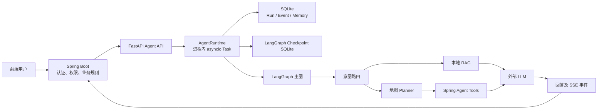
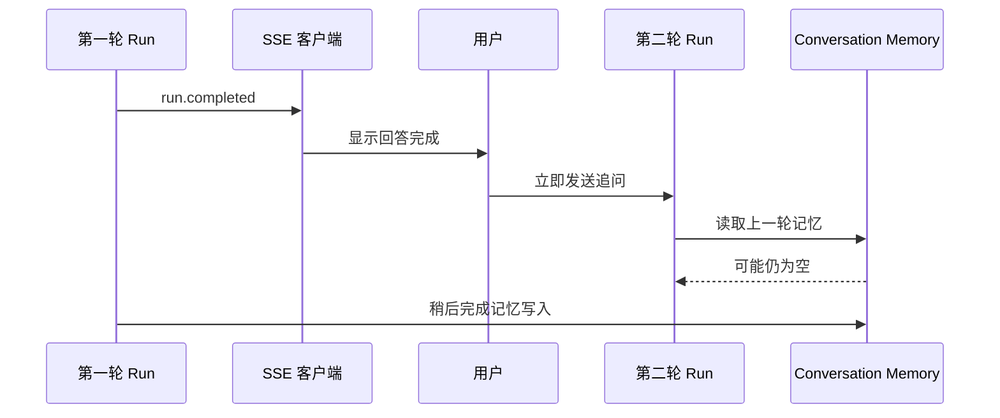
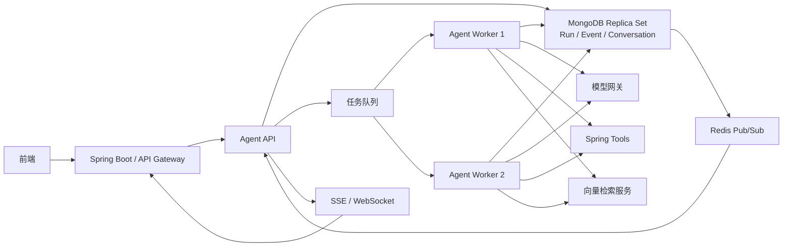

# YJDL LangGraph Agent 业务架构与生产上线审查报告

> 审查日期：2026-08-15  
> 审查范围：LangGraph Agent 编排服务、本地 RAG、Spring Tool 客户端、Run/Event/Checkpoint 持久化、SSE、会话记忆、测试与发布门禁  
> 审查结论：当前版本适合单机、低并发、受控内部试点；在完成 P0 整改前，不建议作为多租户、多副本正式生产系统上线。

## 1. 执行摘要

当前工程已经具备较完整的 Agent 产品骨架：Spring Boot 负责外部认证、权限、业务规则与 GeoScene，FastAPI/LangGraph 负责意图路由、RAG、地图 Tool 规划、回答生成和 SSE 输出。代码对 Tool Catalog、参数、结果、消息幂等和事件契约均进行了较严格的校验。

系统的主要不足不在于“是否实现了功能”，而在于这些能力是否能在真实生产环境中跨进程、跨实例、跨连续请求可靠运行。目前最严重的问题包括：

1. Run 依赖 Web 进程内的 `asyncio.Task`，没有可靠任务队列、执行租约和并发上限。
2. Run、Event、Checkpoint 和会话记忆依赖本机 SQLite，限制横向扩展，并存在写锁和数据无限增长风险。
3. 会话记忆虽然已经实现，但只是最近六轮的自定义短记忆，并存在 `run.completed` 先于记忆提交的竞态。
4. 多个产品上下文字段只通过了契约校验，却没有真正进入业务规划和 Tool 调用。
5. 没有租户限流、成本预算、熔断、队列长度或模型 Token 治理。
6. SSE、Readiness、RAG 和 HTTP Client 的实现方式在并发提高后会形成明显性能瓶颈。

综合判断：该版本的契约完整性和单路径业务正确性较好，但分布式可靠性、容量治理、长期数据治理和真实连续对话能力仍处于试点阶段。

## 2. 当前业务架构



### 2.1 服务边界

- Spring Boot 是外部入口，负责用户认证、权限、业务数据和 GeoScene 能力。
- Agent 服务不直接连接业务数据库或 GeoScene，而是通过 `SpringToolClient` 调用内部 Tool。
- Agent 服务使用静态 Bearer Token 验证 Spring Boot 的内部服务身份。
- `tenantId`、`userId`、`traceId` 通过内部请求头传递，并与 Run 请求体中的用户身份做一致性检查。

### 2.2 Agent 主图

Agent 主图包含四类意图：

- `MAP_QUERY`：地图结构化查询。
- `RAG_QA`：知识库问答。
- `HYBRID`：同时需要地图结果和知识证据。
- `CLARIFY`：条件不足或能力不支持时澄清。

主流程为：

```text
输入归一化
  → 意图路由
  → RAG 检索或加载 Tool Catalog
  → Planner 生成 Tool 参数
  → Spring Tool 执行
  → 结果一致性校验
  → 回答生成
  → Run/Event 持久化与 SSE 输出
```

### 2.3 当前实现的优点

- Spring 业务层和 Agent 编排层职责边界清晰。
- Agent 不允许模型生成任意 URL、SQL 或直接操作 GeoScene。
- Tool Catalog、输入参数和输出结果均进行 JSON Schema 校验。
- 同一消息支持幂等附着，请求变化会返回 `MESSAGE_CONFLICT`。
- `toolCallId` 稳定，有利于 Tool 侧实现执行幂等和失败恢复。
- Run/Event 与 LangGraph Checkpoint 使用不同 SQLite 文件。
- SSE 事件先持久化再发送，支持按 Sequence 重放。
- 模型回答阶段失败后，在已有可靠地图结果或引用时可以生成确定性降级回答。

## 3. 生产就绪度结论

| 使用场景 | 当前判断 | 说明 |
| --- | --- | --- |
| 本地开发和自动化测试 | 可用 | Fake LLM/Tool 覆盖较完整 |
| 单实例、低并发内部试点 | 有条件可用 | 需要持久磁盘、限流和故障监控 |
| 多用户正式生产 | 风险较高 | 缺少容量和成本保护 |
| 多副本、负载均衡部署 | 不建议 | 本机 SQLite 与进程内 Task 无法提供可靠共享状态 |
| 长对话、连续条件修改 | 不稳定 | 当前仅实现有限短记忆和窄范围继承 |
| 高并发 SSE | 不建议 | 高频 SQLite 轮询会形成明显瓶颈 |

## 4. 长记忆功能专项审查

### 4.1 是否实现了长记忆

代码已经实现 `conversation_memory` 表，但更准确的定义是：

> 同一 `tenantId + userId + conversationId` 下最近六轮的自定义短记忆。

它不是 LangGraph 原生的跨轮 Thread Memory。

当前每条记忆包含：

- 用户问题；
- 最终回答；
- 路由类型；
- 地图摘要。

每个会话最多保留 6 条，每条问题和回答最多保留 4000 个字符。

相关实现：

- `app/agent/store.py:248`：读取最近六轮记忆。
- `app/agent/store.py:272`：写入并清理超出数量的记忆。
- `app/agent/runtime.py:338`：Run 执行前加载会话记忆。
- `app/agent/runtime.py:513`：Run 成功后保存会话记忆。

### 4.2 LangGraph Checkpoint 没有形成跨轮会话

LangGraph 的 `thread_id` 当前使用每轮新生成的 `run_id`：

```python
config = {"configurable": {"thread_id": run.run_id}}
```

这意味着每一轮的图状态相互隔离。跨轮上下文完全依赖自定义 `conversation_memory` 表，不能自动继承上一轮 LangGraph State。

### 4.3 已确认的记忆提交竞态

当前执行顺序为：

1. 写入 `run.completed`；
2. SSE 检测到 Run 终态并结束；
3. 再异步保存 conversation memory。

对应代码：

- `app/agent/runtime.py:409`：先写 `run.completed`。
- `app/agent/runtime.py:419`：终态之后保存记忆。
- `app/agent/runtime.py:669`：SSE 看到终态后立即返回。

因此存在以下竞态：



真实用户通常会在看到完整回答后立刻追问，因而比单元测试更容易触发这个窗口。

### 4.4 确定性继承范围过窄

`contextualize_followup_query()` 只确定性处理“本轮只说了一个行政区，但没有说明住宅还是道路”的场景。

可以较稳定处理：

```text
第一轮：查询便利度高的住宅
第二轮：我只要中山区的
```

无法稳定处理：

- “那便宜一点的呢？”
- “第二个附近怎么样？”
- “距离改成 500 米。”
- “西岗区也查一下。”
- “还是刚才那些，但不要超过两万。”
- “刚才推荐的第一个周边道路怎么样？”

这些表达只能依赖模型读取历史问答文本自行推理，没有确定性业务状态保障。

### 4.5 记忆内容不足以支撑业务连续对话

当前记忆没有保存：

- 上一轮最终 Tool arguments；
- 已应用的行政区、价格、距离和偏好条件；
- Tool 返回的候选对象 ID；
- 用户当前选中的业务对象；
- Tool Result Reference；
- 当前业务任务状态；
- 可以被下一轮增删改的结构化槽位。

因此，即使上一轮记忆成功加载，系统也无法可靠解析“第二个”“这些房子”“条件改一下”等对象指代。

### 4.6 多实例部署下会随机丢失记忆

会话记忆位于本机 SQLite。如果第一轮由实例 A 处理、第二轮由实例 B 处理，实例 B 无法读取实例 A 的本地记忆。

```text
第一轮 → Pod A → A 的 SQLite
第二轮 → Pod B → B 的 SQLite → 查不到第一轮
```

使用负载均衡后，该问题会表现为同一用户有时能继承、有时不能继承。

### 4.7 当前数据库快照

本次只读检查工作区数据库得到：

```text
成功 Run：85
失败 Run：12
取消 Run：1
conversation_memory：3 条
conversation scope：1 个
```

历史 Run 可能包含记忆功能上线前的数据，因此不能直接认定所有未匹配 Run 都是当前版本写入失败。但该结果说明系统尚无“成功 Run 是否完成记忆提交”的完整率监控，无法证明记忆链路持续有效。

### 4.8 长记忆整改建议

#### P0：修复终态与记忆提交顺序

将以下操作放入同一个数据库事务：

1. 写入不可变 Conversation Turn；
2. 更新结构化 Conversation State；
3. 写入 `run.completed`；
4. 提交事务。

只有事务成功后，SSE 才允许向客户端暴露完成终态。

#### P0：使用共享数据库

将 Run、Event、Conversation Turn 和 Conversation State 迁移到 PostgreSQL。Redis 可以用于缓存和 Pub/Sub，但不应作为唯一的会话事实来源。

#### P0：保存结构化会话状态

建议至少保存：

```text
entityType
districts
priceMax
bufferMeters
preferences
selectedObjectIds
lastToolName
lastToolArguments
appliedFilters
resultReference
conversationVersion
```

#### P1：增加会话并发控制

同一 Conversation 应使用 `conversationVersion`、乐观锁或串行队列，防止用户同时提交两条消息造成上下文乱序。

#### P1：增加记忆可观测性

建议记录：

- `memory.loaded.count`
- `memory.commit.status`
- `memory.commit.duration`
- `conversation.version`
- `memory.scope.hash`
- `memory.inheritance.fields`

不要在指标或普通日志中记录完整用户原文。

#### P1：补充真实连续对话测试

需要增加：

1. 收到 `run.completed` 后立即发起第二轮。
2. 两个 Agent 实例轮流处理同一 Conversation。
3. Agent 进程重启后继续会话。
4. 同一 Conversation 并发提交两条消息。
5. “第二个”“刚才那些”“再便宜点”等指代测试。
6. 对历史条件进行新增、覆盖和删除。
7. Tool 成功但回答模型失败时的上下文继承。
8. 不同租户、用户和 Conversation 的隔离测试。

## 5. P0：Run 执行可靠性不足

### 5.1 Run 依赖 Web 进程内 Task

Run 使用 `asyncio.create_task()` 在 FastAPI 进程内执行，没有外部任务队列和 Worker 所有权机制。

缺少：

- 最大并发 Run 数；
- 排队长度；
- Worker 执行租约；
- 跨实例抢占保护；
- Worker 心跳；
- 独立于 Web 进程的执行器。

真实后果：

- 突发请求会无限创建 Task，耗尽连接、内存和模型额度。
- 多 Worker 启动时可能同时恢复相同非终态 Run。
- 重复执行会造成重复模型费用和 Tool 调用。
- Web 进程异常退出时，正在执行的任务没有可靠所有权转移。

### 5.2 滚动发布会取消业务 Run

`AgentRuntime.close()` 会取消所有进程内任务。任务收到 `CancelledError` 后会将 Run 写成 `CANCELLED`。

这意味着正常滚动发布也可能把用户正在执行的业务请求永久终止，而不是交给新实例恢复。

### 5.3 建议架构

生产环境建议拆分：

```text
FastAPI API
  → PostgreSQL Run 表或消息队列
  → 独立 Agent Worker
  → Run Lease / Heartbeat
  → PostgreSQL Event Store
  → Redis Pub/Sub 通知 SSE
```

Worker 应通过 `lockedBy`、`leaseUntil` 和周期性 Heartbeat 确保同一 Run 同时只有一个有效执行者。

## 6. P0：SQLite 并发与容量风险

### 6.1 写入串行化

事件写入使用 `BEGIN IMMEDIATE`，在并发 Run、Tool 指标、Stage 指标和 SSE 指标同时写入时，会产生明显锁竞争。

代码虽然设置了 busy timeout 和指数重试，但重试只能缓解短锁，无法解决单写者瓶颈。

### 6.2 SSE 高频轮询

每个 SSE 连接每 50ms 执行一次：

- `list_events()`；
- `get_run()`。

每个客户端约产生每秒 40 次 SQLite 查询。100 个 SSE 连接约为每秒 4000 次查询，还未计算 Run 执行产生的写入。

建议采用：

- 同进程 `asyncio.Condition`；或
- Redis Pub/Sub；或
- PostgreSQL LISTEN/NOTIFY；

仅在断线重放时查询 Event Store，不要持续轮询数据库。

### 6.3 事件保留只是读取过滤

`AGENT_EVENT_RETENTION_SECONDS=86400` 当前只用于查询时过滤旧事件，并没有真正删除：

- agent_events；
- agent_runs；
- Tool/Run/Stage/SSE Metrics；
- LangGraph Checkpoint。

本次工作区快照：

```text
agent.sqlite3：约 6.9 MB
agent-checkpoints.sqlite3：约 29 MB
最早 Event：2026-07-26
```

即使配置了 24 小时保留期，7 月事件在 8 月仍保留在数据库中。

生产环境必须增加定时归档、删除、Checkpoint 清理、VACUUM 策略和容量告警。

## 7. P0：缺少容量和成本治理

代码中未发现：

- 租户级限流；
- 用户级限流；
- 全局最大并发 Run；
- 最大排队长度；
- 每日模型 Token 配额；
- 单 Run 最大模型调用次数；
- 模型费用统计；
- 依赖熔断器；
- 过载时的 429/503 快速拒绝。

真实产品风险：

- 前端重试 Bug 造成重复 Run；
- 恶意或异常用户快速消耗模型额度；
- Spring、Embedding 或模型服务变慢后 Task 大量堆积；
- 单个租户拖垮全部租户。

## 8. 业务正确性问题

### 8.1 RunContext 多数字段只校验、不执行

请求契约包含：

- `roles`；
- `visibleLayerIds`；
- 地图 Extent；
- `businessObjectIds`。

这些字段在当前工作流中基本没有转化为确定性的 Tool 参数或权限条件。

真实后果：

- 用户说“这个小区”时，当前选中对象无法稳定进入 Tool。
- 用户说“只看当前地图范围”时，Extent 不一定生效。
- 当前可见图层无法稳定约束查询。
- Agent 层没有明确角色授权语义。
- 前端产品上下文与单元测试中的纯文本场景不一致。

### 8.2 Tool 数量和 Run 预算不匹配

Planner 最多允许生成 6 个 Tool Call，但执行阶段采用串行循环。

当前预算：

```text
单 Tool Client 超时：125 秒
单 Run 总超时：180 秒
Planner 最大 Tool 数：6
```

两个 Tool 接近超时上限时，Run 总预算已经不足。若第一项成功、第二项被全局超时打断，用户可能仍拿不到最终 `map.result`。

建议：

- 从产品层限制单轮 Tool 数；
- 对无依赖 Tool 并行执行；
- 为每个阶段分配明确 Deadline；
- Planner 生成计划时校验总执行预算；
- 在全局超时前提交已成功的部分结果。

### 8.3 当前并非真正的流式回答

回答模型先生成完整文本，然后系统每 80 个字符切割成 `answer.delta`。

因此首字等待时间仍等于完整模型响应时间。真实用户会长时间看不到回答，从而重复点击或判断系统卡死。

建议使用模型 Provider 的原生 Streaming，并在事件层保存增量或定期 Snapshot。

## 9. 性能与依赖风险

### 9.1 RAG 阻塞异步事件循环

LangGraph 的异步检索节点直接调用同步 `rag.search()`。生产 Embedding Provider 又使用同步 `urllib.request.urlopen()`。

Embedding 服务慢 60 秒时，可能阻塞：

- 其他 Run；
- SSE Heartbeat；
- 取消请求；
- Readiness；
- Tool 回调处理。

应改为异步 HTTP Client，或者通过 `asyncio.to_thread()` 隔离同步检索。

### 9.2 RAG 检索无法扩展

当前启动时把所有 Chunk 和向量加载进内存，每次查询对全部候选进行 NumPy 点积，并重新计算 BM25。

目前只有 46 个 Chunk，性能问题不明显；知识库扩大后，内存和耗时会线性增长。

建议根据规模使用：

- pgvector；
- Qdrant；
- Milvus；
- Elasticsearch/OpenSearch Hybrid Search；
- 预计算 BM25 索引。

### 9.3 Hash Embedding 容易误用于生产

`.env.example` 默认使用 `hash`，当前 Manifest 也显示索引使用 Hash Embedding。Readiness 不会拒绝生产环境使用 Hash Provider。

这会导致同义词、口语化表达和长问题的语义召回质量不稳定，尤其影响老年用户表达。

建议增加：

```text
APP_ENV=production
```

生产模式下如果 Embedding Provider 仍为 `hash`，服务应直接拒绝 Ready。

### 9.4 HTTP 连接没有复用

LLM 和 Spring Tool 在未注入 Client 时，每次请求都会创建新的 `httpx.AsyncClient`。

损失包括：

- Keep-Alive；
- 连接池；
- DNS 缓存；
- TLS 会话复用；
- 并发连接数量治理。

建议在 Application Lifespan 中创建共享 Client，并在关闭时统一释放。

### 9.5 Readiness 探针过重

每次 `/readyz` 都实时请求：

1. Spring Tool Catalog；
2. Spring Tool Health。

客户端超时可达到 125 秒。Kubernetes 高频探针下，Spring 变慢会造成探针堆积、所有 Agent 副本同时 Not Ready，并进一步增加 Spring 压力。

建议后台定时刷新依赖状态，`/readyz` 只读取最近一次结果和刷新时间。探针请求本身应设置 1～3 秒的严格超时。

## 10. 安全与隐私风险

### 10.1 外部模型数据合规

默认模型地址为第三方域名。发送到模型的数据可能包括：

- 当前用户问题；
- 最近六轮会话；
- 知识库内容；
- 地图查询摘要；
- 用户业务上下文。

上线前需要完成：

- 模型供应商审查；
- 数据出境评估；
- PII 脱敏；
- 日志留存协议；
- 请求内容保存策略；
- 租户合同和隐私政策更新。

### 10.2 静态服务 Token 风险

内部认证使用单个长期静态 Bearer Token。Tenant/User 又由请求头声明，Token 泄漏后可伪装任意租户和用户。

建议采用：

- mTLS；
- 短期签名 JWT；
- `iss/aud/exp/jti` 校验；
- Tenant/User Claims 签名；
- 密钥轮换；
- 内网 ACL 和服务网格策略。

### 10.3 Readiness 信息泄露

`/readyz` 返回数据库绝对路径和 Tool Health 细节。若该接口暴露到不可信网络，会泄露部署目录、模型名称和业务依赖状态。

建议公开探针只返回：

```json
{"status": "READY"}
```

详细诊断应放入受管理员权限保护的内部接口。

## 11. 可观测性不足

当前已有 Tool、Stage、Run 和 SSE 耗时指标，这是良好基础。但生产仍缺少：

- 模型 Prompt Token；
- Completion Token；
- 模型费用；
- Provider Request ID 的完整查询链路；
- 当前并发 Run；
- 排队长度；
- SQLite 锁等待时间；
- Checkpoint 大小；
- Event Store 增长率；
- 记忆提交成功率；
- 记忆继承命中率；
- 租户级成功率和 P95；
- Tool/模型熔断状态。

建议接入 OpenTelemetry，并统一 Trace：

```text
Spring traceId
  → Agent Run span
  → Route span
  → RAG span
  → Model span
  → Tool span
  → Spring/GeoScene span
```

## 12. 测试与发布门禁审查

### 12.1 本次实际测试结果

整改前基线曾收集 103 个测试：

```text
97 passed
1 failed
5 skipped
```

当时失败项：

```text
tests/test_agent_runtime.py::RuntimeTests::test_heartbeat_does_not_consume_sequence
```

失败表现为预期 SSE Heartbeat 未出现，并在断言失败后因 `runtime.close()` 未执行而触发 Windows Checkpoint 文件占用错误。该问题已在后续改造中修复。

2026-08-16 完成 P0 改造后的当前结果：

```text
107 passed
5 skipped
0 failed
```

新增专项测试覆盖事务可见性、连续对话、快速追问、多实例租约互斥、租约代数、队列上限、Worker 并发上限和滚动发布恢复。MongoDB 副本集事务也已在本机 `rs0` 单节点上完成真实提交验证。

### 12.2 被跳过的真实环境测试

默认跳过：

- 真实 LLM 测试 2 个；
- 真实 Spring Tool 测试 3 个。

因此普通 `pytest` 通过不能证明：

- 真实模型的 Schema 稳定性；
- 真实 Tool 的响应时间；
- 真实 GeoScene 超时和部分结果；
- 多轮用户连续输入；
- 前端 SSE 断线恢复；
- 多实例部署行为。

### 12.3 生产性能基线尚不存在

当前性能基线为：

```text
source: requires-controlled-live-smoke
sampleCount: 0
p50Ms: null
p75Ms: null
p90Ms: null
p95Ms: null
```

因此代码中虽然有 P95 回归门禁，但尚无真实生产基线可供比较。

### 12.4 长记忆测试覆盖不足

当前测试已验证：

- 最近六条限制；
- Tenant/User 隔离；
- 行政区 Follow-up 继承住宅或道路实体。
- 记忆提交与 `run.completed` 的原子可见性；
- 连续对话、快速追问和多实例租约互斥；
- SQLite 与 MongoDB 存储后端的核心行为。

仍未覆盖多副本故障切换、同会话并发写入的产品策略、复杂指代和结构化条件继承。当前“长记忆”仍是最近 6 轮短记忆，不是无限历史或摘要记忆。

## 13. 工程与部署不足

当前仓库缺少：

- Dockerfile；
- Kubernetes/Compose 部署清单；
- 精确依赖锁文件；
- 面向 MongoDB schema/index 的版本化迁移工具（已有一次性 SQLite → MongoDB 数据迁移命令）；
- 自动备份与恢复脚本；
- 数据归档和删除任务；
- SLO、告警和容量规划文档。

`start.bat` 只启动单个 Uvicorn 进程，更适合本地开发；生产环境应将 API 进程的 `AGENT_WORKER_ENABLED` 设为 `false`，另行运行 `agent-worker` 并配置多个 Worker 实例。

## 14. 整改优先级

### P0：上线阻断项

1. [已完成] 将会话记忆提交和 `run.completed` 放入同一事务。
2. [已完成] 将 Run、Event、Conversation Memory 迁移到共享 MongoDB；MongoDB 必须使用副本集或分片集群。
3. [已完成] 引入独立 Worker、任务队列、Run Lease 和并发上限。
4. [待完成] 增加用户、租户和全局限流及成本配额。
5. [待完成] 实现结构化会话状态，而不是只保存问答文本。
6. [已完成] 修复滚动发布时释放租约并重新入队的行为。
7. [已完成] 增加多实例、快速追问、连续对话和滚动发布恢复测试；仍需真实多节点故障演练。

### P1：首个生产版本前完成

1. 将 RAG 和 Embedding 改为异步或线程隔离。
2. 使用共享 HTTP Client 和连接池。
3. 改造 SSE 为通知驱动，避免 50ms 数据库轮询。
4. 实现真正的模型 Token Streaming。
5. 增加 Event、Metric 和 Checkpoint 清理任务。
6. 将 Readiness 改为后台刷新状态。
7. 接入模型 Token、成本和 Conversation Memory 指标。
8. 生产环境禁止 Hash Embedding。
9. 完成模型数据合规和 PII 脱敏方案。

### P2：稳定运营阶段

1. 接入 OpenTelemetry 和统一 Trace。
2. 引入数据库迁移、备份、恢复和演练机制。
3. 扩展 RAG 到正式向量库和预构建 BM25 索引。
4. 建立业务场景评测集和长期质量回归。
5. 建立租户级 SLO、容量规划和费用看板。

## 15. 建议的目标架构



目标架构的核心原则：

- API 接收请求，但不在 Web 进程内长期执行 Run。
- MongoDB 副本集是 Run、Event 和 Conversation 的事实来源；交易语义依赖副本集或分片集群。
- LangGraph Checkpoint 当前仍使用独立 SQLite 文件，不能作为多实例共享 Checkpoint 存储。
- Worker 通过租约确保单 Run 单执行者。
- Redis 只负责通知和缓存，不承担唯一事实存储。
- 会话状态使用结构化版本模型。
- 模型、Tool 和检索均受统一 Deadline、并发、限流和熔断控制。
- SSE 由事件通知驱动，不持续轮询数据库。

## 16. 最终结论

当前系统的主要价值在于：业务边界、Tool 契约、地图结果保护、Run/Event 语义和确定性规则已经形成了较好的工程基础。

但真实上线后的主要故障不会集中在单个 Planner 是否能输出正确 JSON，而会集中在：

- 用户快速连续追问时上一轮记忆尚未提交；
- 负载均衡把下一轮请求发送到另一个实例；
- 高峰期无限创建 Run Task；
- Checkpoint SQLite 文件在多实例部署中的共享与备份边界；
- 模型或 Tool 变慢后探针、任务和连接一起堆积；
- 数据、Checkpoint 和指标长期不清理；
- 线上模型费用和 Token 消耗不可控；
- UI 传入的选中对象和地图上下文没有真正进入业务规划。

因此当前版本已具备单节点 MongoDB + 多 Worker 的生产候选基础，但仍不应直接定义为完整“多租户生产版”。完成限流、结构化会话状态、Checkpoint 共享化、故障演练和真实负载测试后，再进入正式生产发布评审。

## 17. 2026-08-16 P0 整改落地记录

本次实现已完成以下整改：

1. `complete_run_with_memory()` 将 Conversation Memory 与 `run.completed` 放入同一 SQLite 事务；MongoDB 后端使用同一 Session Transaction。只有事务提交后，SSE 才能观察到终态事件。
2. 新增 `MongoAgentStore`，Run、Event、Conversation Memory、Tool/Run/SSE/Stage 指标均可切换到 MongoDB；`agent-store-migrate` 支持从既有 SQLite 幂等迁移 Run/Event/Memory。
3. Run 创建状态改为 `QUEUED`，新增 Worker 并发上限、队列上限、租约领取/续租/释放和过期接管；`agent-worker` 可作为独立进程运行，滚动关闭会释放租约并重新排队，不会写入 `run.cancelled`。
4. 补充连续对话、快速追问原子可见性、多实例单执行者、租约接管、滚动发布、并发上限、队列满和 Mongo Store 测试。

### 17.1 部署约束

API 进程与 Worker 进程可以拆分部署。API 进程使用：

```text
AGENT_STORAGE_BACKEND=mongodb
AGENT_MONGODB_URI=mongodb://127.0.0.1:27017/?replicaSet=rs0
AGENT_WORKER_ENABLED=false
```

Worker 进程使用同一 MongoDB URI，并执行：

```text
start.bat worker
# 或：python -m app.cli.agent_worker --env-file .env
```

MongoDB 必须是副本集或分片集群；`AGENT_MONGODB_REQUIRE_TRANSACTIONS=true` 时，standalone 实例会在初始化阶段被拒绝。Spring Boot 的 Mongo 端口、数据目录和认证配置不需要修改，Agent 使用独立数据库 `yjdl_agent`。

本机 MongoDB 已配置为 `rs0` 单节点副本集，`127.0.0.1:27017` 已验证为 `PRIMARY`，并完成真实事务提交测试。生产环境必须使用副本集或分片集群；standalone MongoDB 会被 `AGENT_MONGODB_REQUIRE_TRANSACTIONS=true` 拒绝启动。

仍需在正式生产版本补齐：LangGraph Checkpoint 的共享存储、结构化 Conversation State/版本控制、租户级限流与成本配额、SSE 通知驱动、数据归档与备份，以及真实 Spring Tool/LLM 压测。当前六轮问答记忆仍属于短记忆，不等同于无限长记忆。

## 18. 2026-08-16 真实用户链路测试

测试环境：Spring Boot `127.0.0.1:8080`、MongoDB `rs0`、隔离 API `127.0.0.1:8010`、独立 Agent Worker、独立 Mongo 数据库。测试完成后已删除临时数据库。

### 18.1 通过项

- Spring Tool 真实合约：Catalog、点/线图层查询、住宅联合检索，`3 passed`。
- 真实 LLM：RAG 图和地图 Planner，`2 passed`。
- 真实模型首轮 SSE：`run.started`、心跳、路由、答案增量和 `run.completed` 均正常。
- 已完成后的连续追问：两个 Run 均为 `SUCCEEDED`，Mongo 中产生两条 Conversation Memory。
- 同一 `messageId` 重试：返回原 Run，状态 `202`，未重复执行。
- 同一 `messageId` 修改请求内容：返回 `409 MESSAGE_CONFLICT`。
- 诊断接口：返回 Tool、Orchestration、SSE、Stage 和 Model 调用信息。

### 18.2 仍然失败的真实场景

快速追问并发测试中，第二条消息在第一条 Run 尚未完成时到达。两条 Run 最终都成功，但第二条 Run 读取不到第一条尚未提交的记忆，回答无法识别“刚才的指标”。Mongo 中可以观察到第二条记忆的 `created_at` 早于第一条记忆。

这证明当前实现已经解决“记忆提交与 `run.completed` 顺序竞态”，但尚未解决“同一会话未完成 Run 的因果继承”。如果产品要求用户在上一轮生成过程中立即追问，必须增加会话级串行队列、前序 Run 依赖或显式 pending context；仅依赖已提交的 Conversation Memory 不足以支持该交互。

### 18.3 全量测试状态

最新全量测试结果为：

```text
106 passed
1 failed
5 skipped
```

失败项为 `tests/test_agent_runtime.py::RuntimeTests::test_running_checkpoint_is_completed_after_runtime_restart`。该测试单独运行及完整 `test_agent_runtime.py` 均通过，表现为全量运行时的间歇性时序/测试隔离问题，不能作为发布通过依据，需继续修复或隔离。

五项生产缺口的详细修复设计见：[production-gap-remediation-plan-2026-08-16.md](D:/XQYproject/YJDLagent/docs/production-gap-remediation-plan-2026-08-16.md)。

## 19. 2026-08-16 P1 实施结果

快速追问的因果继承已改为会话串行依赖：后续 Run 会记录前序未终态 Run，Worker 在前序提交前不会领取；领取时会刷新 `base_state_version`。结构化 `conversation_states`、Conversation Memory 与 `run.completed` 现在处于同一事务边界。

LangGraph Checkpoint 已支持 MongoDB 共享存储并使用会话 ID 作为线程 ID。限流和配额已提供 Redis 原子后端，Token usage 会写入幂等账本。备份、隔离恢复校验、生命周期预览/执行脚本及真实 Mongo 副本集回归测试已补齐。

最终验证为 `111 passed, 7 skipped, 0 failed`；另外显式启用的 Mongo live 2 项、Spring Tool live 3 项和真实模型烟测 2 项均通过。
