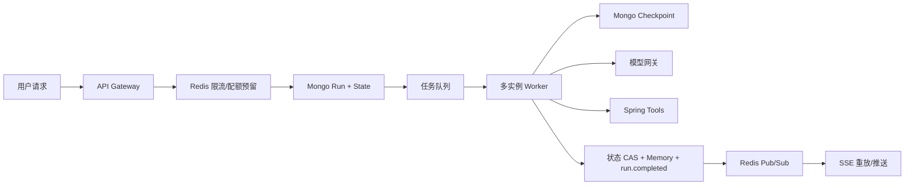

# 生产缺口修复方案

> 日期：2026-08-16  
> 范围：Checkpoint 共享化、结构化 Conversation State、租户限流与成本配额、备份恢复、真实多实例压测  
> 前置事实：Run/Event/Conversation Memory 已支持 MongoDB 副本集；Worker 已具备租约和并发上限；快速追问在前序 Run 未完成时仍无法继承前序内容。

## 1. 目标与原则

本方案解决的是“多实例、长对话、可控成本和可恢复运营”，不是继续增加单路径 Planner 规则。所有改造遵循以下原则：

1. MongoDB 是 Run、Event、Conversation State 和 Checkpoint 的共享事实来源。
2. 同一会话的状态通过版本号和 Compare-And-Set 更新，禁止旧 Worker 覆盖新状态。
3. 快速追问默认按会话串行执行；产品如果需要并行，必须显式声明读取版本。
4. 配额采用“创建时预留、完成时结算、失败时释放未使用额度”的账务模型。
5. 备份、恢复、压测和滚动发布都必须有可重复的自动化门禁，不以人工观察替代。

目标流程：



## 2. 缺口一：LangGraph Checkpoint 共享化

### 2.1 当前问题

`AgentRuntime` 使用 `AsyncSqliteSaver` 写本机 `agent-checkpoints.sqlite3`，多副本之间不可见；`thread_id` 目前使用每个 Run 的 `run_id`，不能形成跨轮会话恢复。SQLite 文件还会受到滚动发布、容器重建和文件锁影响。

### 2.2 目标设计

新增 `MongoCheckpointSaver`，实现 LangGraph `BaseCheckpointSaver` 的异步接口，使用以下集合：

| 集合 | 主键/索引 | 用途 |
|---|---|---|
| `agent_checkpoints` | `(tenant_id, user_id, conversation_id, checkpoint_ns, checkpoint_id)` 唯一 | 图状态快照 |
| `agent_checkpoint_writes` | `(thread_id, checkpoint_ns, checkpoint_id, task_id, idx)` 唯一 | pending writes |
| `agent_checkpoint_leases` | `(thread_id, owner, lease_generation)` | 恢复和写入互斥 |

Checkpoint 文档至少包含：`schema_version`、`tenant_id`、`user_id`、`conversation_id`、`run_id`、`checkpoint_id`、`parent_checkpoint_id`、`channel_values`、`channel_versions`、`versions_seen`、`metadata`、`created_at`。

图配置改为：

```text
thread_id = conversation_id
checkpoint_ns = agent-v2
run_id      = 当前 Run ID（写入 metadata，不再作为 thread_id）
```

同一会话的每个 Run 使用 `base_checkpoint_id` 作为输入版本；完成时生成新的 checkpoint。Checkpoint 写入使用唯一键和父版本校验，旧 Worker 写入失败时必须放弃，不得覆盖新版本。

### 2.3 迁移和回滚

1. 引入 `AGENT_CHECKPOINT_BACKEND=sqlite|mongodb`，默认生产使用 MongoDB，开发环境允许 SQLite。
2. 新版本先对旧 SQLite Checkpoint 做一次离线迁移，保留 `legacy_thread_id=run_id` 映射。
3. 灰度阶段双读：Mongo 缺失时只读取已登记的 SQLite 旧版本，并记录 `checkpoint_fallback_total`。
4. 连续 7 天无 fallback 后关闭 SQLite 读取，保留只读备份 30 天。
5. 回滚只允许回到“读 Mongo、写 Mongo”的兼容版本；禁止回滚到会写旧 SQLite 的版本，避免双向覆盖。

### 2.4 验收标准

- 任意 Worker 被杀死后，另一实例可从 Mongo Checkpoint 继续执行，重复 Tool 调用率为 0。
- 两个 Worker 同时抢占同一会话时，只有一个能提交新的 checkpoint 版本。
- 2 个 API + 3 个 Worker 滚动发布期间，Checkpoint 丢失率为 0。
- Checkpoint 写入 P95 < 100ms，写入失败可重试且不产生重复版本。

## 3. 缺口二：结构化 Conversation State 与版本控制

### 3.1 数据模型

新增 `conversation_states` 集合，一条会话一条当前状态：

```json
{
  "tenantId": "t-1",
  "userId": "u-1",
  "conversationId": "c-1",
  "stateVersion": 42,
  "lastCommittedRunId": "run-42",
  "activeRunId": null,
  "entityContext": {
    "districts": ["中山区"],
    "housingObjectIds": [],
    "roadObjectIds": [],
    "selectedLayerIds": [2, 3]
  },
  "queryContext": {
    "hardFilters": {},
    "preferences": {},
    "roadCriteria": {},
    "spatial": {}
  },
  "mapContext": {
    "visibleLayerIds": [2, 3],
    "zoom": 13,
    "extent": null
  },
  "summary": "最近会话摘要",
  "facts": [],
  "updatedAt": "2026-08-16T12:00:00Z"
}
```

所有结构化字段必须通过 Pydantic/JSON Schema 校验；模型只能提出候选状态，不能直接覆盖持久化状态。

### 3.2 Run 状态机和快速追问策略

Run 创建时读取 `stateVersion`，写入：

```text
baseStateVersion
dependsOnRunId
stateReadAt
```

默认策略为“同会话单活跃 Run”：

1. 会话没有活跃 Run：Run 进入 `QUEUED`，获得当前 `stateVersion`。
2. 会话已有活跃 Run：新 Run 仍可幂等创建，但设置 `dependsOnRunId=activeRunId`，状态为 `BLOCKED`/`QUEUED`。
3. Worker 只有在依赖 Run 进入终态后才能领取下一 Run。
4. 前序 Run 成功时，下一 Run 读取最新 `conversation_states` 和 Checkpoint；前序失败时，按产品策略选择继续使用旧版本或返回“前序失败，请重试”。
5. 完成提交使用事务：`stateVersion + 1`、Memory、`run.completed`、`lastCommittedRunId` 一起提交。

如果产品必须支持并行 Run，则不能声称两轮互相继承；每个 Run 必须显式携带 `readStateVersion`，并在提交时做三方合并或返回 `STATE_VERSION_CONFLICT`。

### 3.3 长记忆策略

- 最近 6 轮：保留原始问答，满足短期上下文。
- 6 轮以上：异步生成摘要，摘要版本与 `stateVersion` 绑定。
- 结构化实体和过滤条件：永久保留到租户配置的 TTL，用户可清除。
- 原始文本：按租户保留策略删除；敏感字段进入脱敏流程后再送模型。
- 检索记忆：只从已提交版本读取，不把其他会话或未提交 Run 暴露给模型。

### 3.4 验收标准

- 前序 Run 未完成时的快速追问不会读取未来状态；默认被正确排队并在前序提交后继承。
- 同会话 100 次连续追问，状态版本严格单调递增，无覆盖和丢失。
- 旧版本 Worker 提交返回 `STATE_VERSION_CONFLICT`，不会改变当前状态。
- 结构化实体继承命中率和错误继承率分别纳入指标，错误继承率目标为 0。

## 4. 缺口三：租户限流、Token 配额与成本预算

### 4.1 统一配额服务

使用 Redis Cluster 实现分布式 Token Bucket 和计数器；Mongo 只保存结算账本，不承担高频限流。所有计数键必须包含 `tenant_id`，用户级键再包含 `user_id`。

建议默认配置：

| 维度 | 默认值 | 超限响应 |
|---|---:|---|
| 用户请求速率 | 10 req/min | `429 RATE_LIMITED` |
| 租户请求速率 | 120 req/min | `429 RATE_LIMITED` |
| 租户活跃 Run | 20 | `429 CONCURRENCY_LIMIT` |
| 租户排队 Run | 100 | `429 RUN_QUEUE_FULL` |
| 单 Run 模型调用 | 12 次 | `429 RUN_MODEL_CALL_LIMIT` |
| 每日 Token | 2,000,000 | `429 TOKEN_QUOTA_EXCEEDED` |
| 每日费用 | 按租户合同配置 | `429 COST_BUDGET_EXCEEDED` |

所有值必须配置化，不写死在 Planner 或 Runtime 中。

### 4.2 预留、结算和释放

Run 创建流程：

1. 校验身份和请求幂等键。
2. 若是已有相同请求，直接 attach，不重复扣配额。
3. 预留最大 Token/费用额度和一个活跃 Run 槽位。
4. 写入 Run 的 `quota_reservation_id`。
5. Worker 每次模型调用前检查剩余额度。
6. 模型响应读取 `usage.prompt_tokens`、`completion_tokens`、`total_tokens`，按模型价格表计算实际成本。
7. 终态事务写入结算账本并释放未使用预留。

新增集合：

```text
quota_reservations
quota_ledger
tenant_budgets
model_price_catalog
```

账本必须以 `reservation_id + operation_id` 唯一，保证重试不会重复计费。

### 4.3 熔断和降级

- 模型连续 5xx/超时达到阈值，按模型/租户维度打开熔断。
- Spring Tool 失败只对对应 Tool 熔断，不阻塞 RAG 查询。
- 预算不足时禁止 Planner 重试和 Answer 重试；已有可靠地图结果可走确定性降级回答。
- 所有 429 响应返回 `Retry-After` 和可机器读取的 `details`。

### 4.4 验收标准

- 10 个 API 实例并发创建时，租户活跃 Run 不超过配置上限。
- 同一个 `messageId` 重试不重复扣费。
- 预算达到 100% 后新 Run 被拒绝，已运行 Run 能在安全边界内完成或停止。
- 每个 Run 的 Token、费用、模型调用次数都能在 Diagnostics 和账本中对账。

## 5. 缺口四：备份、恢复与数据生命周期

### 5.1 MongoDB 备份

生产 MongoDB 使用副本集/分片集群，并配置：

- 每日全量 `mongodump` 或云快照；
- oplog/PITR 连续归档；
- 至少 30 天在线备份、90 天离线归档；
- 备份加密、密钥独立保管、异地存储；
- 每周自动恢复到隔离 Mongo 集群并运行校验脚本。

备份范围：Run、Event、Memory、Conversation State、Checkpoint、Quota Ledger。SSE/Stage 原始指标按成本决定是否只备份聚合结果。

### 5.2 RAG 和配置备份

- `rag.sqlite3`、`chunks.jsonl`、`manifest.json` 必须与文档版本绑定备份。
- 模型价格表、Catalog 版本、租户配额和环境配置进入版本库，不把密钥写入备份。
- 备份记录包含 `backup_id`、源集群、Mongo `oplog` 时间点、应用版本和 schema 版本。

### 5.3 恢复流程

1. 先恢复 Mongo 到目标时间点。
2. 校验唯一索引、事件序列连续性、Memory 与 `run.completed` 一致性。
3. 将所有 `RUNNING` 且 Lease 已过期的 Run 改回 `QUEUED`。
4. 保留 `SUCCEEDED/FAILED/CANCELLED` 终态，不重新执行。
5. 恢复 API 只读模式，完成抽样校验后再开放写入。
6. 恢复 Redis 限流状态时全部按保守值重建，不能恢复为无限额度。

目标：RPO <= 5 分钟，RTO <= 30 分钟；每季度完成一次带故障注入的恢复演练。

### 5.4 生命周期和删除

- Event/SSE：默认 24 小时在线，归档 7 天后删除。
- Memory：按租户策略保留，默认 180 天。
- Checkpoint：只保留最近 N 个可恢复版本和终态 Run 的最终版本。
- Quota Ledger：至少保留 13 个月，满足对账和审计。
- 删除租户时按依赖顺序删除 State、Memory、Run/Event、Checkpoint、Ledger，并写入删除审计记录。

## 6. 缺口五：真实多实例压测与发布门禁

### 6.1 固定测试拓扑

第一阶段使用可控依赖：

```text
2 API 实例
3 Worker 实例
1 MongoDB rs0/测试集群
1 Redis
Spring Tool：真实服务 + 可控故障代理
LLM：真实模型烟测 + 确定性模型 Stub 压测
```

真实模型不用于高并发压测，避免费用和外部服务波动污染容量结论；真实模型只做每日小规模契约烟测。

### 6.2 场景矩阵

| 场景 | 关注点 | 必须断言 |
|---|---|---|
| 连续 100 轮同会话 | State 版本和 Checkpoint | 无覆盖、无乱序 |
| 10% 快速追问 | 会话依赖 | 下一 Run 不早于前序提交 |
| 20% 重复消息 | 幂等 | 单 messageId 只执行一次 |
| Worker 随机杀死 | Lease 接管 | 无双执行，最终只产生一个终态 |
| API 滚动发布 | SSE 重连/重放 | Sequence 无缺口、无重复终态 |
| Mongo 主节点切换 | 事务和重试 | Memory 与 completed 一致 |
| 租户突发流量 | 限流/配额 | 429 可预测，其他租户不受拖累 |
| Spring Tool 变慢 | Deadline/熔断 | 不造成 Worker、连接和队列雪崩 |

### 6.3 工具和指标

- HTTP/SSE：k6 或 Locust，必须支持断线重连和自定义 Header。
- Worker 故障：PowerShell/容器 kill + 定时注入 Lease 过期。
- Mongo 故障：测试副本集主节点切换和网络抖动。
- 指标：接收 P50/P95/P99、首事件延迟、完成 P95、队列等待、Lease 接管、重复 Tool、Memory 继承命中率、Token/费用、429 比例、SSE 重放缺口。

### 6.4 发布门禁

建议初始门槛：

```text
Run 重复执行率 = 0
重复 run.completed = 0
Event Sequence 缺口 = 0
Memory/Run.completed 不一致 = 0
快速追问错误继承率 = 0
租户配额超发 = 0
API 接收 P95 <= 300ms
SSE 首事件 P95 <= 2s
Worker Lease 接管成功率 >= 99.9%
```

任何门槛失败都阻止滚动发布；只允许在隔离环境重新运行并留下报告后重试。

## 7. 分阶段实施计划

### Phase 1：基础设施和数据模型（1 周）

- 引入 Mongo Checkpoint 集合、索引和兼容 Saver。
- 建立 `conversation_states`、版本号和状态 Schema。
- 引入 Redis 客户端、租户配额配置和价格目录。
- 编写 Mongo 备份/恢复/校验脚本。

### Phase 2：运行时语义（1 周）

- 将 `thread_id` 切换为 `conversation_id`，加入 Checkpoint 迁移。
- 实现会话依赖队列和 State CAS。
- 接入 Token usage、成本结算和熔断。
- 补齐 pending context、连续对话、快速追问和版本冲突测试。

### Phase 3：验证和发布（1 周）

- 建立 2 API + 3 Worker 的 Compose/Kubernetes 测试拓扑。
- 执行场景矩阵和 Mongo 恢复演练。
- 修复全量测试中的 Checkpoint 重启时序失败，并将全量门禁设为 0 failure。
- 先灰度 5% 租户，再扩大到 25%/100%。

## 8. 交付物和责任边界

| 交付物 | 位置/形式 | 完成标志 |
|---|---|---|
| Mongo Checkpoint Saver | `app/agent/mongo_checkpoint.py` | 多实例恢复测试通过 |
| Conversation State Schema | `app/agent/conversation_state.py` | State CAS 和版本冲突测试通过 |
| 配额服务 | `app/agent/quota.py` + Redis | 限流、结算、对账测试通过 |
| 备份恢复工具 | `scripts/backup_agent_store.*` | 隔离集群恢复演练通过 |
| 压测脚本 | `tests/load/` 或独立压测仓库 | 发布门禁报告生成 |
| 运行手册 | `docs/runbooks/` | 值班人员可按步骤恢复 |

## 9. 最终验收

只有同时满足以下条件，才允许将系统标记为正式多实例生产版：

1. 全量测试 0 failure，live Spring/LLM 烟测通过。
2. 同会话快速追问严格按前序提交顺序继承，错误继承率为 0。
3. API、Worker、Checkpoint、Run/Event/State 均可跨实例恢复。
4. 租户限流、Token 配额和成本账本可实时阻断并准确对账。
5. Mongo、RAG 索引和配置完成恢复演练，RPO/RTO 达标。
6. 多实例压测达到门槛，滚动发布和故障注入无数据一致性问题。

## 10. 2026-08-16 实施状态

已完成并进入自动化回归的内容：

1. MongoDB Checkpoint Saver 已启用共享 `thread_id=conversation_id`，支持父版本校验、幂等写入、pending writes 和旧 Run fallback。
2. Run 新增 `depends_on_run_id`、`base_state_version`；SQLite/Mongo Worker 均会跳过依赖未终态的 Run，并在领取时刷新最新状态版本。
3. 新增 `conversation_states`；State、Conversation Memory 和 `run.completed` 在同一 SQLite/Mongo 事务内提交，旧版本提交返回 `STATE_VERSION_CONFLICT`。
4. 新增进程内/Redis 两种配额后端、Token 预留/结算/释放和 `quota_ledger` 幂等账本；模型响应 usage 已按异步 Run 上下文累计。
5. 新增 Mongo 备份、隔离恢复校验和生命周期脚本，以及真实副本集多实例/快速追问/Checkpoint 测试。

仍需生产环境提供或执行的外部条件：Redis Cluster 地址、异地备份存储、定时调度器，以及固定 `2 API + 3 Worker` 拓扑的持续压测基础设施。代码已提供门禁测试接口，但容量数值必须在目标机器和真实网络条件下重新测量。

本次实现后的验证结果：

- 全量测试：`111 passed, 7 skipped, 0 failed`；跳过项均为需显式开关的 live 测试。
- 本机 MongoDB `rs0`：2 项 live 测试通过，覆盖并发 API 创建依赖链、多实例领取、快速追问和共享 Checkpoint。
- Spring Tool：3 项真实合约测试通过。
- 真实模型：RAG 与地图 Planner 2 项烟测通过。
